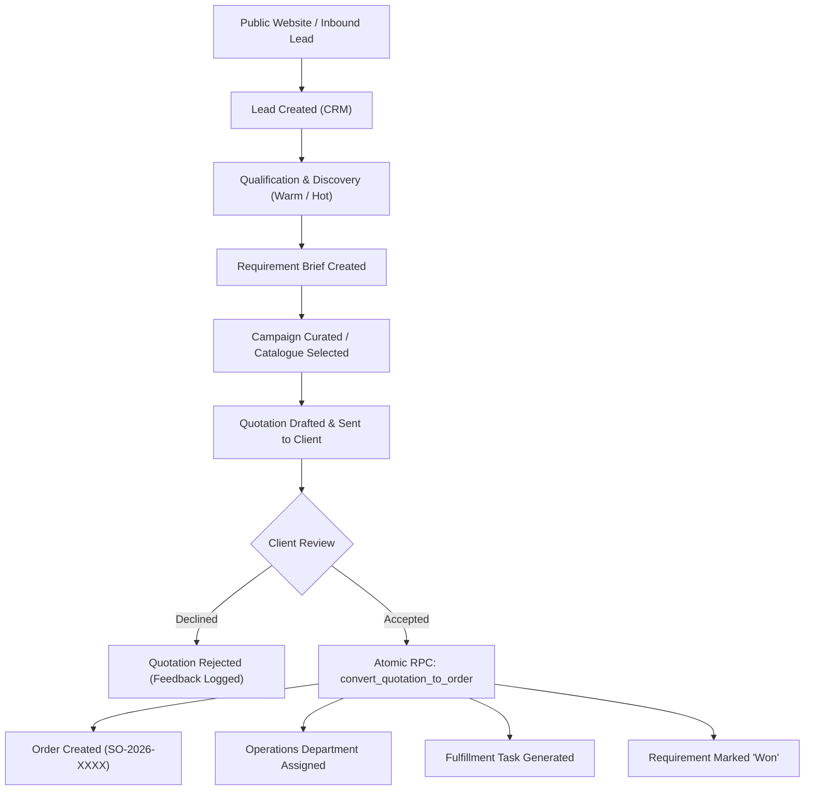
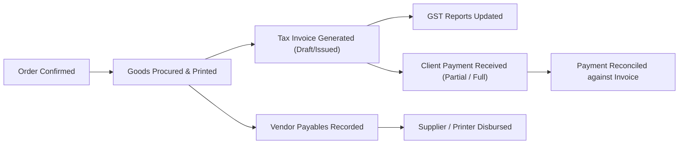
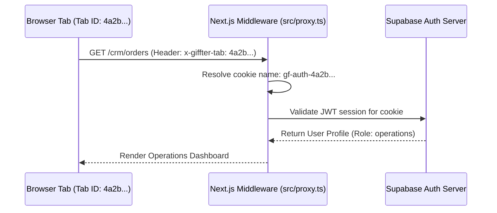

# Souvenir - Gifting Solutions — Application Architecture, Workflows & Feature Specification

> **Product**: Souvenir - Gifting Solutions (Corporate Gifting CRM / ERP)  
> **Repository**: `VIAayush/corporate-gifting-crm`  
> **Production URL**: [https://giffter.vercel.app/](https://giffter.vercel.app/)  
> **Primary Database**: Supabase Postgres (`ajysowosgjaipczrwpfv`, AWS `ap-south-1`)  
> **Framework**: Next.js 16 (App Router) + React 19 + TypeScript + Tailwind CSS 4  

---

## 1. Executive Overview

**Souvenir - Gifting Solutions** is an enterprise B2B Corporate Gifting CRM and Fulfillment ERP platform. It unifies the end-to-end lifecycle of corporate gifting into a single integrated platform:

1. **Public Storefront & Lead Capture**: Public catalogue discovery, curated theme collections, and multi-item quote request cart generating inbound CRM prospects.
2. **Personalized Client Portal (`/portal`)**: Company-isolated interface where corporate buyers view company-approved catalogues, review curated campaigns, submit requirements, approve/reject quotations, track multi-stage order fulfilment, and download invoices and mockups.
3. **Internal Operational CRM/ERP (`/crm`)**: Role-based workspace for Sales, Operations, Procurement, Printing, Logistics, Accounts, and Management to manage leads, quotes, orders, inventory samples, vendor relations, billing, and SLA tracking.

---

## 2. Complete Feature Inventory

The platform is partitioned into three discrete access surfaces:

```
┌─────────────────────────────────────────────────────────────────────────┐
│                     SOUVENIR GIFTING PLATFORM                           │
├────────────────────┬────────────────────────────┬───────────────────────┤
│  1. Public Store   │   2. Client Portal         │   3. Internal CRM/ERP │
│  - Landing Page    │   - Client Dashboard       │   - Workspace         │
│  - Public Catalog  │   - Curated Campaigns      │   - Customer Hub      │
│  - Categories      │   - Company Catalogue      │   - Sales Engine      │
│  - Collections     │   - Shortlisting Cart      │   - Order Center      │
│  - Quote Request   │   - Interactive Quotations │   - Operations/SOP    │
│  - Brand Story     │   - Order Tracking         │   - Finance & Tax     │
│                    │   - Document Center        │   - Executive Admin   │
└────────────────────┴────────────────────────────┴───────────────────────┘
```

### 2.1. Public Storefront (Unauthenticated / Anonymous)

* **Hero Landing (`/`, `/home`)**: Showcases curated gifting solutions, company capabilities, featured product tiers, corporate trust badges, and navigation into gifting categories.
* **Public Catalogue (`/catalogue`, `/catalogue/[id]`)**: Full browsing experience for active products marked with `catalogue_access = 'all'`. Displays high-resolution imagery, SKU, minimum order quantity (MOQ), tiered pricing, specifications, and "Request a Quote" actions.
* **Category Directory (`/categories`, `/categories/[slug]`)**: Hierarchical taxonomy browsing by main categories and subcategories (e.g. Eco-Friendly, Tech & Gadgets, Executive Hampers, Drinkware, Apparel).
* **Curated Collections (`/collections`, `/collections/[slug]`)**: Thematic campaigns such as Diwali Gifting, Employee Welcome Kits, Festive Hampers, and Annual Day awards.
* **Quote Request Cart (`/request-quote`)**:
  * Single-item and multi-product cart mode.
  * Lead data capture: Name, Work Email, Company, Phone, Estimated Quantity, Programme Notes.
  * Honeypot anti-spam defense (`fax` trap field).
  * Automatically creates or links a `Company` (`prospect`), registers a `Contact` (`corporate`), and creates a `Lead` (`source='website'`, `stage='warm'`) in the CRM.
* **About Page (`/about`)**: Company background, procurement ethics, branding & packaging customization capabilities, logistics reach, and fulfillment guarantees.

---

### 2.2. Client Portal (`/portal`)

Restricted to client profiles (`client_admin`, `client_user`), strictly scoped to their assigned `company_id`.

* **Client Dashboard (`/portal`)**: High-level snapshot of active orders, pending quotations requiring action, recent briefs, and company announcements.
* **Personalized Catalogue (`/portal/catalogue`, `/portal/catalogue/product/[id]`)**:
  * Powered by the secure PostgreSQL view `client_products`.
  * Clients see **only** items where `status = 'active'` AND either `catalogue_access = 'all'` or their company has an explicit grant in `company_product_access`.
  * Completely strips internal fields (supplier identity, supplier cost, profit margin, internal notes).
* **Campaign Offerings (`/portal/campaigns`, `/portal/catalogue/[sku]`)**: Curated client-specific campaigns created by sales reps (e.g. "Wipro Diwali 2026"). Displays published campaign products with tailored corporate pricing.
* **Shortlist / Wishlist (`/portal/shortlist`)**: Clients shortlist products from active campaigns (`client_product_selections`) to collaborate internally before submitting final requirements.
* **Requirements Submissions (`/portal/requirements`, `/portal/requirements/new`)**: Direct portal form for corporate clients to submit new gifting briefs (target headcounts, budget per kit, target delivery deadline, destination cities, design preferences).
* **Quotations Hub (`/portal/quotations`, `/portal/quotations/[id]`)**:
  * View issued quotations with full line-item breakdowns, tax, and discount schedules.
  * Interactive client decision buttons: **Accept Quotation** or **Decline Quotation** with mandatory reason/feedback.
* **Order Tracking (`/portal/orders`, `/portal/orders/[id]`)**:
  * Real-time order progress timeline mapped to client-friendly labels (e.g., *Order Received* → *Order Confirmed* → *In Production* → *Quality Check* → *Dispatched* → *Delivered*).
  * Courier partner and live tracking numbers.
  * Masks internal operational tickets and cost breakdowns.
* **Documents Vault (`/portal/documents`)**: Single point of download for issued Tax Invoices (`invoices`) and client-approved branding mockups/visual proofs (`mockups` marked `shared`).

---

### 2.3. Internal CRM & ERP (`/crm`)

Divided into logical functional clusters with granular role-based access:

#### A. Workspace (All Internal Roles)
* **Role-Specific Dashboard (`/crm/dashboard`)**: Tailored KPIs depending on whether the user is an Admin, Sales Executive, Operations Manager, Accounts Specialist, or Executive Manager.
* **My Work (`/crm/my-work`)**: Single-pane workstation aggregating records assigned to the current user:
  * Orders pending action in the user's department.
  * Tasks assigned with due dates.
  * Stalled leads requiring urgent customer follow-up.
* **Tasks Center (`/crm/tasks`)**: Operational task management with status filtering (`open`, `in_progress`, `blocked`, `done`, `cancelled`), priority weights, due dates, order associations, and audit trail of completion.

#### B. Customer Hub (`admin`, `sales`, `management`)
* **Companies (`/crm/companies`, `/crm/companies/[id]`, `/crm/companies/new`)**: Master corporate account directory. Tracks corporate details, logo uploads (`company-logos` storage bucket), assigned sales owner, account status (`prospect`, `active`, `inactive`), billing addresses, GSTIN, and linked branches/departments.
* **Contacts (`/crm/contacts`)**: Stakeholder management per company. Stores designations, emails, phone numbers, and contact types (`primary`, `billing`, `operations`, `executive`).

#### C. Sales Engine (`admin`, `sales`, `management`)
* **Leads Pipeline (`/crm/leads`, `/crm/leads/[id]`, `/crm/leads/new`)**:
  * Lead stages: `cold` → `warm` → `hot` → `client` → `regular_client`.
  * Lead value estimation, expected closing date, source attribution, and next follow-up dates.
  * Stage-loss protection: Database prevents accidental downgrade of `hot` leads without explicit override.
* **Goal Tracker (`/crm/goals`)**: Target setting and tracking for sales reps across time periods (`monthly`, `quarterly`, `annual`) and metrics (revenue, deal count, conversion rate).
* **Requirements Management (`/crm/requirements`, `/crm/requirements/[id]`)**: Customer briefs tracking budget, target quantity, delivery cities, event dates, and progress towards quotation.
* **Campaign Studio (`/crm/campaigns`, `/crm/campaigns/[id]`)**: Curates bespoke product selections for specific client accounts, setting custom client pricing and controlling public/published status.
* **Activities Feed (`/crm/activities`)**: Timeline of all customer interactions (phone calls, emails, on-site meetings, follow-up notes) linked to companies, leads, or orders.

#### D. Product & Asset Hub (`admin`, `sales`, `operations`, `management`)
* **Product Master (`/crm/products`, `/crm/products/[id]`, `/crm/products/new`, `/crm/products/import`)**:
  * Product catalogue CRUD: SKU, name, brand, category, subcategory, base price, supplier cost, internal target margin, MOQ, image URL.
  * **Catalogue Access Rules**:
    * `all`: Globally visible to all portal clients and public store.
    * `selected`: Accessible only to companies explicitly granted access in `company_product_access`.
    * `none`: Strictly internal product (hidden from all portals/storefronts).
  * Bulk CSV product import tool with column validation.
* **Mockups & Design Storage (`/crm/mockups`)**: Digital asset manager for product branding proofs, embroidery files, laser engraving mockups, and client visual approval status (`internal` vs `shared`).
* **Physical Samples Inventory (`/crm/samples`)**:
  * Real-time physical sample tracking across 4 holder locations:
    1. *In Office Stock*
    2. *With Client* (evaluation kits)
    3. *With Team / Sales Reps* (on-field pitch samples)
    4. *Pending Supplier* (ordered prototypes)
  * Complete sample movement ledger (`sample_movements`) logging quantity, source holder, destination holder, associated client/deal, and sample unit cost.

#### E. Operations & Fulfillment Hub (`admin`, `operations`, `management`)
* **Order Control Center (`/crm/order-management`)**:
  * Operational cockpit featuring **dual views**: Kanban Board (by fulfillment stage) and Sortable Data Table.
  * Automated Order Health Algorithm:
    * **On Track** (Emerald): Normal SLA progress.
    * **At Risk** (Amber): Stage due within 3 days or delivery deadline approaching.
    * **Delayed** (Red): Stage due date or promised delivery date breached.
  * Granular filters: By Client, Department, Employee, Stage, Health, and Delivery Date range.
* **Order Detail & Fulfilment (`/crm/orders/[id]`)**: Full order dossier showing line items, PO numbers, operational assignee, linked supplier, printing partner, courier partner, tracking number, gross profit calculation, status progression, and status audit log.
* **Department Workload Hub (`/crm/department`)**: Queue management per operational department (`sales`, `operations`, `procurement`, `printing`, `logistics`, `accounts`), showing active orders, SLA compliance, and pending departmental tasks.
* **Vendor & Partner Directory**:
  * **Suppliers (`/crm/suppliers`)**: Product manufacturer database, credit period days, credit limits, categories, and payment terms.
  * **Printing Vendors (`/crm/printing-vendors`)**: Branding partners categorized by technique (Screen Printing, UV Printing, Embroidery, Laser Engraving, Embossing, Digital Printing).
  * **Courier Partners (`/crm/courier-partners`)**: Shipping carriers, tracking integrations, point of contact, and performance notes.

#### F. Finance & Accounts (`admin`, `accounts`, `management`)
* **Quotations (`/crm/quotations`, `/crm/quotations/[id]`)**:
  * Quote generator calculating subtotals, item discounts, tax percentages (GST), and grand totals.
  * Generates client PDF/printable quotations.
  * Direct one-click **Quotation to Order Conversion** executing the atomic database stored procedure `convert_quotation_to_order`.
* **Invoices (`/crm/invoices`, `/crm/invoices/[id]`)**: Tax invoice generation linked to completed or in-progress orders, due dates, payment status (`draft`, `issued`, `partially_paid`, `paid`, `overdue`, `cancelled`).
* **Payments (`/crm/payments`)**: Client payment logging, reference number tracking (UTR/Cheque/Transaction ID), payment modes (NEFT, RTGS, UPI, IMPS), and reconciliation against outstanding invoices.
* **Receivables (`/crm/receivables`)**: Accounts receivable aging dashboard, outstanding payment balances, and collection follow-ups.
* **Payables (`/crm/payables`)**: Outgoing vendor liabilities (Suppliers, Printers, Logistics partners), due dates, and settlement records.
* **GST Reports (`/crm/gst-reports`)**: Tax compliance portal displaying invoice-level tax analysis, company GSTINs, intra-state vs inter-state classification (CGST+SGST vs IGST), and date-filtered exports.

#### G. Executive & System Administration (`admin`, `management`)
* **Executive Reports (`/crm/reports`)**: Business intelligence reports covering pipeline velocity, monthly sales volume, gross profit margins per order, sample stock valuation, and fulfillment bottlenecks.
* **Executive Tracking (`/crm/tracking`)**: Real-time management surveillance of open orders, overdue departmental tasks, and operational assignment history.
* **Client Reviews (`/crm/reviews`)**: Client satisfaction scoring, post-delivery feedback logs, and testimonials.
* **Audit Trail (`/crm/audit-log`)**: Immutable security audit log tracking entity modifications (who changed what, previous values, new values, timestamps, and user IP/context).
* **Team Management (`/crm/team`)**: Employee management, role assignment (`admin`, `sales`, `operations`, `accounts`, `management`), department assignments, and active account toggles.
* **Organization Settings (`/crm/settings`)**: Company profile, default tax rates, currency formatting, system-wide defaults.
* **Knowledge Center (`/crm/knowledge`) & Announcements (`/crm/announcements`)**: Internal SOPs, order workflow guidelines, and team-wide bulletin broadcasting.

---

## 3. Core Workflows & State Machines

### 3.1. Lead-to-Order Sales Workflow



### 3.2. Nine-Stage Order Fulfillment Lifecycle

Every order advances through a deterministic 9-stage operational lifecycle, managed via the database stored procedure `advance_order_stage`:

```
┌─────────────────────────────────────────────────────────────────────────┐
│                     ORDER FULFILLMENT LIFECYCLE                         │
└─────────────────────────────────────────────────────────────────────────┘
  [1] created            ──▶ Order Received / Sales Confirmation
         │
  [2] confirmed          ──▶ Order Confirmed / Ops Planning
         │
  [3] procurement        ──▶ Sourcing blanks & raw goods from Supplier
         │
  [4] printing           ──▶ Branding / Screen print / Engraving with Vendor
         │
  [5] quality_check      ──▶ QC Inspection against approved mockup
         │
  [6] ready_to_dispatch  ──▶ Packaging, boxing & shipping label generation
         │
  [7] dispatched         ──▶ Handed to Courier Partner (Tracking active)
         │
  [8] delivered          ──▶ Received by Client / Confirmation logged
         │
  [*] cancelled          ──▶ Terminal cancellation state (reversible by Admin)
```

#### Department Routing Matrix by Stage:
| Stage | Internal Status Label | Client Portal Label | Responsible Department |
| :--- | :--- | :--- | :--- |
| `created` | Order Received | Order Received | Sales |
| `confirmed` | Planning | Order Confirmed | Sales / Operations |
| `procurement` | Procurement | Procurement | Procurement / Operations |
| `printing` | Printing | Printing in Progress | Printing / Operations |
| `quality_check` | Quality Check | Quality Check | Quality Assurance |
| `ready_to_dispatch` | Packing | Ready to Dispatch | Logistics |
| `dispatched` | In Transit | Dispatched | Logistics |
| `delivered` | Delivered | Delivered | Accounts (Invoicing) |
| `cancelled` | Cancelled | Cancelled | Operations / Management |

### 3.3. Financial Lifecycle



---

## 4. Architecture & Technical Infrastructure

### 4.1. Technology Stack

* **Front-End / Full-Stack Framework**: Next.js 16.3.4 (App Router)
* **Runtime**: Node.js 20+ with React 19.2.8 (`react`, `react-dom`)
* **Styling**: Tailwind CSS 4 with PostCSS
* **UI Components**: Radix UI primitives (Dialog, Dropdown, Popover, Select, Tabs, Checkbox, Avatar, Toast) + Lucide Icons + Sonner
* **Database & Auth**: Supabase (PostgreSQL 15+, Supabase Auth, Storage, Row-Level Security)
* **Client Library**: `@supabase/ssr` 0.12.5 and `@supabase/supabase-js` 2.112.4
* **Hosting**: Vercel Serverless Edge Platform
* **Database Hosting**: AWS `ap-south-1` (Mumbai)

### 4.2. Tab-Isolated Authentication Architecture

A core design innovation in this platform is **Tab-Level Session Isolation** (`src/lib/auth/tab.ts` and `src/proxy.ts`):

* **Problem**: In standard cookie-based authentication, logging into an Admin account in Tab A overrides or clashes with a Client account in Tab B within the same browser.
* **Solution**:
  1. The browser assigns each tab a unique cryptographic 8-byte hex identifier (`giffter.tab-id` stored in `sessionStorage`).
  2. The custom Next.js reverse proxy (`src/proxy.ts`) reads the tab ID from the header `x-giffter-tab` or URL query `giffter_tab`.
  3. Cookies are partitioned per tab: `gf-auth-<tabId>`.
  4. Multiple sessions (e.g. Sales rep, Operations manager, and Client) can run simultaneously in the same browser window without session crosstalk.



### 4.3. Multi-Tenant Security & Row-Level Security (RLS)

Data segregation is enforced at the database level via PostgreSQL Row-Level Security:

1. **Client Isolation**:
   * Portal users (`client_admin`, `client_user`) can **never** query the `products` table directly.
   * Clients query exclusively through the `SECURITY DEFINER` view `public.client_products`.
   * The view evaluates `public.client_company_id()` derived server-side from `auth.uid()`, ensuring clients can only discover items explicitly assigned to their company or flagged as universal.
   * Supplier identities, cost prices, internal margins, and raw vendor costs are excluded from the view projection.
2. **Sales Rep Isolation**:
   * Sales reps have read/write access strictly to the leads, requirements, quotations, and orders they own (`owner_id = auth.uid()`), unless elevated to `admin` or `management`.
3. **Operations Isolation**:
   * Operations personnel see orders assigned directly to them (`assigned_to = auth.uid()`) or assigned to their specific department (`current_department_id`).
4. **Historical Data Immutability**:
   * Quotation items and Order items store explicit snapshot prices and product references. Even if a product's catalogue access is subsequently revoked or altered, historical order and invoice records remain intact.

---

## 5. Database Schema & Core Entities

The system maintains 30+ relational tables with foreign keys and cascade protections:

| Table Name | Description | Key Relationships / Fields |
| :--- | :--- | :--- |
| `profiles` | User directory & RBAC | `id` (references `auth.users`), `role`, `department_id`, `company_id`, `is_active` |
| `companies` | Client & prospect accounts | `id`, `name`, `status`, `owner_id`, `logo_path`, `address`, `gst_number` |
| `contacts` | Corporate stakeholders | `id`, `company_id`, `full_name`, `email`, `phone`, `contact_type` |
| `leads` | Sales opportunities | `id`, `company_id`, `contact_id`, `owner_id`, `stage`, `estimated_value`, `source` |
| `requirements` | Client RFPs and briefs | `id`, `company_id`, `owner_id`, `quantity`, `budget`, `deadline`, `status` |
| `campaigns` | Curated client offering bundles | `id`, `company_id`, `name`, `status`, `start_date`, `end_date` |
| `campaign_products` | Products mapped to a campaign | `campaign_id`, `product_id`, `client_price`, `visibility` |
| `client_product_selections`| Client wishlist selections | `campaign_id`, `campaign_product_id`, `selected_by`, `notes` |
| `products` | Master catalogue items | `id`, `sku` (unique), `name`, `price`, `supplier_cost`, `catalogue_access`, `moq` |
| `company_product_access` | Specific product grants | `company_id`, `product_id` (composite primary key) |
| `quotations` | Quotation documents | `id`, `quotation_number`, `company_id`, `owner_id`, `subtotal`, `tax_amount`, `total`, `status` |
| `quotation_items` | Products in quotation | `quotation_id`, `product_id`, `quantity`, `unit_price`, `line_total` |
| `orders` | Confirmed fulfillment orders | `id`, `order_number`, `company_id`, `status`, `expected_delivery_date`, `order_value` |
| `order_items` | Products in order | `order_id`, `product_id`, `quantity`, `unit_price`, `line_total` |
| `order_status_history` | Audit trail of stage changes | `order_id`, `from_status`, `to_status`, `changed_by`, `note`, `changed_at` |
| `order_assignments` | Department/person handoffs | `order_id`, `department_id`, `assigned_to`, `assigned_by`, `note` |
| `departments` | Operational divisions | `id`, `name`, `slug` (`sales`, `operations`, `procurement`, `printing`, `logistics`, `accounts`) |
| `suppliers` | Product manufacturers | `id`, `name`, `credit_period_days`, `credit_limit`, `contact_person` |
| `printing_vendors` | Customization partners | `id`, `name`, `service_type`, `phone`, `city` |
| `courier_partners` | Shipping carriers | `id`, `name`, `tracking_supported`, `contact_person` |
| `sample_stock` | Physical inventory ledger | `product_id`, `in_office`, `with_client`, `with_team`, `pending_supplier` |
| `sample_movements` | Sample movement logs | `product_id`, `quantity`, `from_holder`, `to_holder`, `company_id`, `cost` |
| `invoices` | B2B Tax Invoices | `id`, `invoice_number`, `order_id`, `company_id`, `amount`, `status`, `invoice_date` |
| `payments` | Customer remittances | `id`, `invoice_id`, `amount`, `payment_date`, `method`, `reference` |
| `payables` | Outgoing vendor liabilities | `id`, `vendor_type`, `vendor_name`, `order_id`, `amount`, `amount_paid`, `status` |
| `goals` | Sales rep revenue targets | `id`, `owner_id`, `period_type`, `period_start`, `metric`, `target` |
| `tasks` | Action items | `id`, `title`, `order_id`, `department_id`, `assigned_to`, `due_at`, `status` |
| `activities` | Interaction timeline | `id`, `type` (call, email, meeting), `company_id`, `lead_id`, `created_by` |
| `audit_logs` | Immutable system audit log | `table_name`, `record_id`, `action`, `previous_data`, `new_data`, `user_id` |

---

## 6. Role-Based Access Control (RBAC) Matrix

| Module / Route | Admin | Sales | Operations | Accounts | Management | Client Admin / User | Public |
| :--- | :---: | :---: | :---: | :---: | :---: | :---: | :---: |
| **Public Storefront** | View | View | View | View | View | View | View |
| **Public Quote Request** | Submit | Submit | Submit | Submit | Submit | Redirects | Submit |
| **Client Portal** | - | - | - | - | - | Full (Own Co) | - |
| **CRM Dashboard** | Full | Sales KPIs | Ops KPIs | Finance KPIs | Exec KPIs | - | - |
| **My Work & Tasks** | Full | Owned | Assigned | Assigned | Full | - | - |
| **Companies & Contacts** | Full | Owned/Assigned | Read | Read | Full | - | - |
| **Leads & Pipeline** | Full | Owned Only | - | - | Full | - | - |
| **Product Master CRUD** | Full | Read Only | Read Only | Read Only | Read Only | - | - |
| **Catalogue Access Rules** | Full | Read Only | - | - | Read Only | - | - |
| **Samples Inventory** | Full | Read/Move | Full | Read | Read | - | - |
| **Quotations** | Full | Create/Edit | Read Only | Read Only | Full | View (Sent) | - |
| **Order Control Center** | Full | Owned Orders | Assigned / Dept | Read Only | Full | - | - |
| **Advance Order Stage** | Yes | - | Yes | - | - | - | - |
| **Invoices & Payments** | Full | Read | Read | Full | Full | Invoices Only | - |
| **GST Reports** | Full | - | - | Full | Full | - | - |
| **Team Management** | Full | - | - | - | - | - | - |
| **System Audit Logs** | Full | - | - | - | Read | - | - |

---

## 7. Storage, Security & Infrastructure Setup

### 7.1. Storage Buckets (Supabase Storage)
* `company-logos`: Stores corporate client logo files. Publicly readable via CDN; writable by authenticated staff.
* `product-images`: High-resolution imagery for catalogue items. Publicly readable via CDN.
* `mockups`: Design files and vector artwork. Accessible internally and selectively shared with portal clients.

### 7.2. Environment Variables Specification
```bash
# Public Variables (Client & Server)
NEXT_PUBLIC_SUPABASE_URL=https://ajysowosgjaipczrwpfv.supabase.co
NEXT_PUBLIC_SUPABASE_ANON_KEY=eyJhbGciOi...
NEXT_PUBLIC_APP_NAME="Souvenir - Gifting Solutions"

# Server-Only Variables (Required for Admin User Provisioning & Secure RPCs)
SUPABASE_SERVICE_ROLE_KEY=eyJhbGciOi...
```

### 7.3. Error Boundaries & Progressive Web App (PWA)
* **Error & Not-Found Boundaries**: Configured at root (`src/app/error.tsx`, `src/app/not-found.tsx`, `src/app/global-error.tsx`), CRM root (`src/app/crm/error.tsx`), and Portal root (`src/app/portal/error.tsx`). Portal error views intentionally disguise 404s to prevent unassigned catalogue discovery probing.
* **Progressive Web App**: Supported via `/manifest.webmanifest` and service worker `/sw.js`, providing responsive mobile workstation capabilities for sales reps and logistics handlers on mobile devices.
